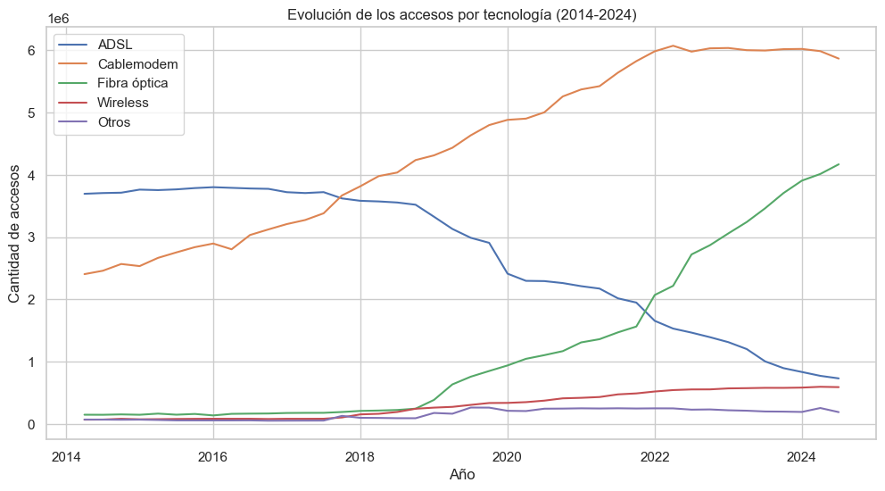
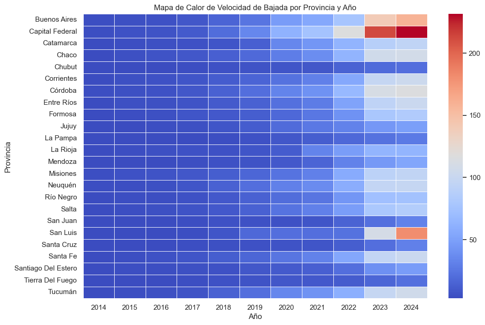
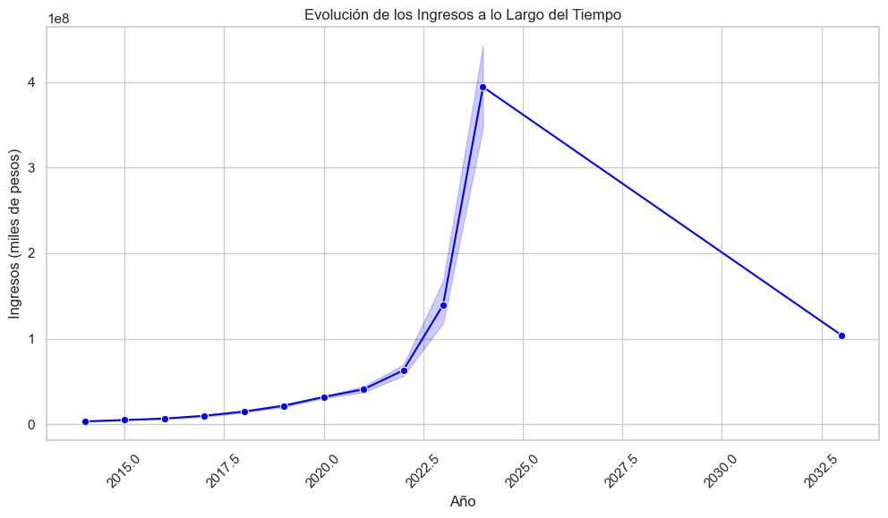

# Proyecto Individual Nº2 - Telecomunicaciones


## Descripción del Proyecto
Este proyecto se centra en el análisis de datos del sector de telecomunicaciones con el objetivo de extraer insights clave, visualizar tendencias y evaluar indicadores de desempeño (KPIs). Como parte del desarrollo, se realizaron tareas de Análisis Exploratorio de Datos (EDA), construcción de un dashboard interactivo y documentación en un repositorio de GitHub.

## Objetivos
- Realizar un Análisis Exploratorio de Datos (EDA) sobre el dataset proporcionado.
- Construir un dashboard interactivo para la visualización de KPIs.
- Analizar tendencias y patrones en los datos.
- Documentar el proceso y hallazgos en un repositorio de GitHub.

## Selección de Datos
Para este análisis, se utilizaron datos abiertos del **Ente Nacional de Comunicaciones (ENACOM)**, disponibles en su plataforma oficial: [ENACOM - Datos Abiertos](https://indicadores.enacom.gob.ar/datos-abiertos-servicios).

### Tablas Utilizadas y Descripción:
#### 1. **Internet**
- Contiene información desde 2014 hasta 2024, desglosada por provincia y trimestre.
- Variables clave: total de hogares, población, penetración de internet, velocidad de conexión y tipo de tecnología (ADSL, Cablemódem, Fibra óptica, Wireless, Otros).
- Incluye datos sobre ingresos por servicio.

#### 2. **Telefonía Móvil**
- Datos desde 2013, discriminados por prepago y pospago.
- Incluye: cantidad de llamadas, minutos totales, acceso y penetración.
- Contiene información sobre ingresos por trimestre y problemas reportados en el servicio.

#### 3. **Televisión**
- Información sobre acceso y penetración de TV paga y TV abierta.
- Datos desglosados por provincia y trimestre desde 2014.

#### 4. **Telefonía Fija**
- Datos de acceso total por hogares, comercio, gobierno y otros.
- Métricas de penetración por cada 100 habitantes y 100 hogares.
- Datos de ingresos por servicio, disponibles por provincia y trimestre desde 2014.

#### 5. **Portabilidad Numérica**
- Registra la cantidad total de portaciones por mes en Argentina desde 2012 hasta 2024.

#### 6. **Servicios Postales**
- Datos sobre ventas y unidades de servicios postales, telegráficos y monetarios.
- Información desglosada por trimestre, mes y provincia desde 2013 hasta 2025.
- Incluye datos sobre el empleo en el sector postal.

#### 7. **Mapa de Conectividad**
- Muestra la disponibilidad de tecnologías de conexión (ADSL, Cablemódem, Dial Up, Fibra óptica, Satelital, Wireless, Telefonía Fija, 3G, 4G) por localidad.
- Datos organizados por localidad, partido y provincia.
- Contiene información sobre la población estimada.

## Criterios de Selección y Transformación de Datos

El enfoque del análisis se basa en la relevancia de cada conjunto de datos para el objetivo del proyecto:

Internet: Se priorizan los datos a nivel provincial y total, descartando el desglose por localidades para facilitar el análisis.

Mapa de Conectividad: Se utilizaron únicamente las provincias y se transformaron los datos en binarios (Sí = 1, Null = 0) para facilitar su procesamiento.

Portabilidad: Se utiliza la tabla completa, ya que contiene datos consolidados de portabilidad numérica.

Televisión: Se analizan los accesos totales por año, trimestre y tipo de televisión (satelital y por suscripción).

Telefonía Fija: Se emplea la hoja de penetración total, discriminando por categorías (Total, Hogares, Comercio, Gobierno y Otros) e ingresos.

Telefonía Móvil: Se utilizaron las hojas de ingresos y penetración total

Este proceso de selección y transformación garantiza que el análisis sea eficiente y enfocado en los aspectos más relevantes para la evaluación de las telecomunicaciones en Argentina.


##Estructura del Repositorio

Dataset/

Carpeta que contiene las planillas Excel con los datos utilizados para realizar el análisis.

notebooks/

Carpeta que contiene los Jupyter Notebooks utilizados en el análisis.

EDA.ipynb: Aquí se realiza el proceso de extracción, transformación y limpieza de los datos. Se identificaron y eliminaron datos redundantes, atípicos y nulos, preparando la información para un análisis más limpio y efectivo. Se identifican tendencias, distribuciones y valores críticos. Las conclusiones de este análisis se utilizaron para diseñar el dashboard y se presentan en el informe.

eda_complementario.ipynb: Análisis adicional de los datos para profundizar en ciertas métricas y tendencias relevantes.

proyecto-telecomunicaciones.pbix

Archivo del dashboard desarrollado en Power BI para la visualización de KPIs y métricas clave.

README.md

El archivo que estás leyendo. Contiene la descripción del proyecto, objetivos, estructura y documentación relevante.
## Tecnologías Utilizadas
- **Lenguaje de Programación**: Python
- **Bibliotecas**: Pandas, NumPy, Matplotlib, Seaborn, Plotly, Dash/Streamlit (según aplicación)
- **Herramientas de Visualización**: Power BI 
- **Control de Versiones**: Git/GitHub


```
## Análisis de Datos
Se implementaron diversas técnicas para explorar y comprender los datos, asegurando su calidad y relevancia para el análisis.

1. Limpieza y Preprocesamiento de Datos
Se eliminaron valores nulos y duplicados.
Se estandarizaron los formatos de fechas y nombres de provincias.
Se crearon variables binarias para facilitar el análisis de disponibilidad de tecnologías.
2. Análisis Descriptivo de Variables Clave
Se realizó un análisis detallado de las principales variables para identificar patrones y distribuciones.
Evolucion de internet
El gráfico muestra la evolución de los accesos a distintas tecnologías de conexión a internet entre 2014 y 2024.

"C:\Users\yanin\OneDrive\Desktop\proyecto 2\archivos\imagenes\imagen1.png" 



Conclusión:La fibra óptica se ha convertido en la tecnología dominante, desplazando al ADSL y superando al Cablemodem. Esto refleja una tendencia global hacia conexiones más rápidas y estables.
Velocidad:
El gráfico es un mapa de calor que muestra la velocidad de bajada por provincia y año en Argentina, desde 2014 hasta 2024. Los colores azules indican las velocidades de bajada más bajas, mientras que los colores más cercanos al rojo representan velocidades más altas.

Conclusiones:

Mejora en la conectividad: A medida que avanza el tiempo, especialmente desde 2020, la mayoría de las provincias muestran un aumento en la velocidad de bajada de la conexión a Internet, reflejando un mejoramiento general en la infraestructura de internet en el país.

Desigualdad en la mejora: Aunque hay un aumento general en la velocidad de bajada, algunas provincias, como Tierra del Fuego y Mendoza, presentan años con velocidades más bajas en comparación con otras provincias. Esto puede reflejar desigualdad en el acceso o en la calidad de la infraestructura.

Concentración en años recientes: En los últimos años, la mayoría de las provincias presentan valores de velocidad de bajada más altos, lo que sugiere una expansión en el acceso a tecnologías más rápidas, como fibra óptica o 4G/5G.


Este tipo de mapa es útil para visualizar rápidamente las tendencias regionales en el tiempo, destacando la evolución de la iLa gráfica es una gráfica de líneas que muestra la evolución de los ingresos a lo largo del tiempo en miles de pesos.

Conclusiones:

1. Crecimiento exponencial hasta 2025: Se observa un aumento progresivo de los ingresos desde los primeros años hasta 2025, con un crecimiento acelerado a partir de 2022. Esto podría estar relacionado con un auge económico, mejoras en el sector o un incremento en la demanda.


Es importante analizar los factores detrás de esta caída para entender si es una fluctuación temporal o una tendencia estructural.nfraestructura tecnológica en distintas zonas.


3. Evaluación de Correlaciones y Patrones
🔍 Se analizaron correlaciones entre variables clave, identificando relaciones como:

Alta correlación entre ingresos y cantidad de accesos en telefonía móvil e Internet.
Tendencia negativa en la penetración de telefonía fija, reflejando la transición a tecnologías móviles.


## Dashboard Interactivo
Se desarrolló un dashboard utilizando [Power BI ] para visualizar los principales indicadores del sector de telecomunicaciones. Algunas de las visualizaciones incluidas son:
- Evolución temporal de los indicadores clave.
- Comparaciones de KPIs entre distintas categorías.


   ```

## Contribuciones
Si deseas contribuir a este proyecto, siéntete libre de hacer un fork, realizar mejoras y enviar un pull request.

## Contacto
Yanina Spina  
[LinkedIn](https://www.linkedin.com/in/yaninaspina)  
[GitHub](https://github.com/YaninaSpina)

---

